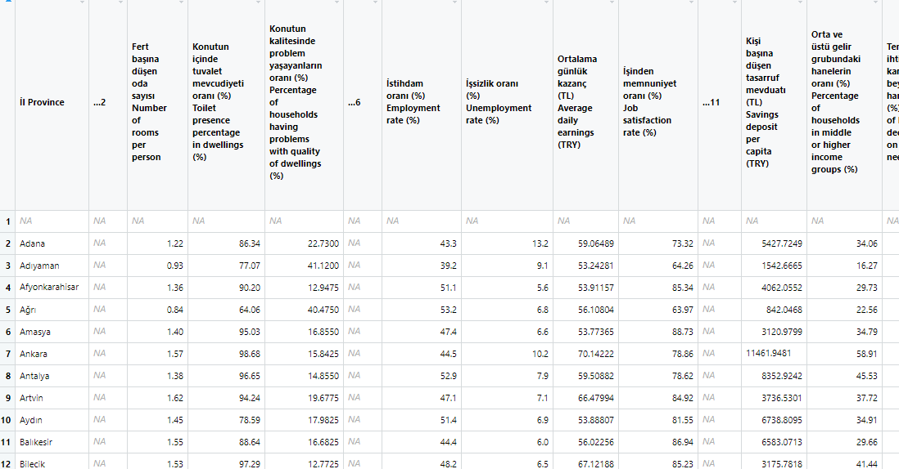
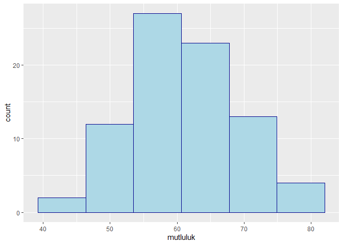
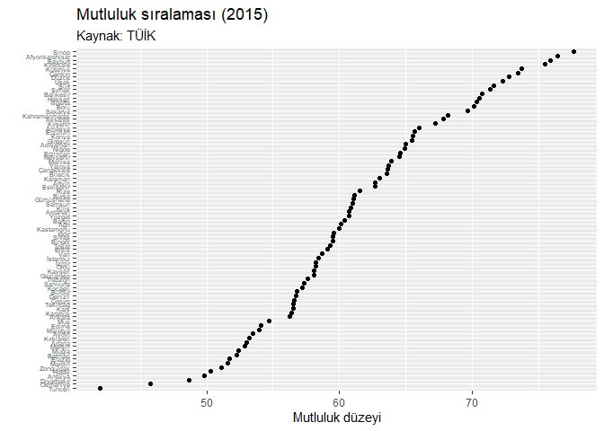
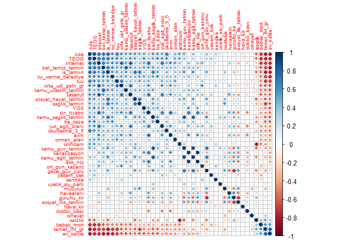
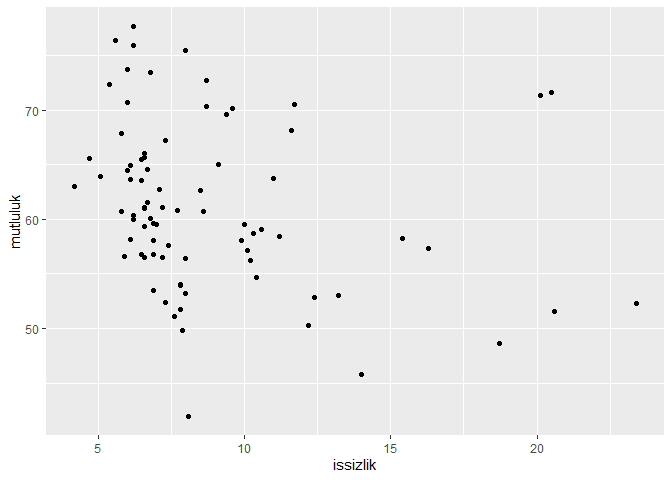
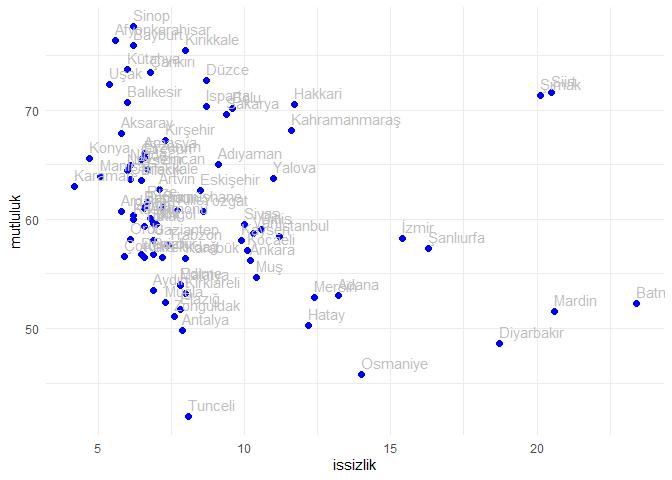

<style type="text/css"> 
body{
  background-color: #FAFAFA;
  font-size: 18px;
  line-height: 1.8;
}
code.r{
  font-size: 12pt;
}
</style>
<br>


# Türkiye'de Yaşam Memnuniyeti Göstergeleri (2015)

Bu RMarkdown dosyasında Türkiye İstatistik Kurumu'ndan (TÜİK) alınan 2015 yılına ait il bazında yaşam memnuniyeti göstergelerinin basit bir analizi sunulmuştur. 

# Veriler

## Verilerin Okutulması ve Hazırlanması

Önce `data/mutluluk2015.xls` adresindeki verileri okutalım: 

```r
library(tidyverse)
```

```
## -- Attaching core tidyverse packages ------------------------ tidyverse 2.0.0 --
## v dplyr     1.1.1     v readr     2.1.4
## v forcats   1.0.0     v stringr   1.5.0
## v ggplot2   3.4.2     v tibble    3.2.1
## v lubridate 1.9.2     v tidyr     1.3.0
## v purrr     1.0.1     
## -- Conflicts ------------------------------------------ tidyverse_conflicts() --
## x dplyr::filter() masks stats::filter()
## x dplyr::lag()    masks stats::lag()
## i Use the conflicted package (<http://conflicted.r-lib.org/>) to force all conflicts to become errors
```

```r
library(readxl) 
veriler <- read_excel("data/mutluluk2015.xls", range = "A6:BA88")
```

```
## New names:
## * `` -> `...2`
## * `` -> `...6`
## * `` -> `...11`
## * `` -> `...15`
## * `` -> `...21`
## * `` -> `...27`
## * `` -> `...33`
## * `` -> `...38`
## * `` -> `...42`
## * `` -> `...47`
## * `` -> `...52`
```

`View(veriler)` ile verileri incelediğimizde bazı gözlemlerin boş olduğunu (NA) ve değişken isimlerinin çok uzun olduğunu görüyoruz. Bunun dışında veriler düzenli (tidy) formattadır.



Boş sütunları silelim:


```r
# ismi "..." ile başlayan boş sütunları sil
veriler <- veriler %>% 
  dplyr::select(-contains('...'))
# note: select() may not work right if MASS is package is also loaded
```

Ayrıca ilk satırı sil:


```r
veriler <- veriler |> drop_na()
```

Şimdi elimizde 81 il için 42 değişkenden oluşan bir veri seti var. Ancak değişken isimleri çok uzun. Bunları değiştirelim.


```r
# TR isimlendirme
# mevcut veri setindeki değişken isimlerini içeren karakter vektörü
isim_tanim <- names(veriler)
```

Bu karakter vektörünü bir kenarda tutalım. Sütunlardaki değişkenlerin tanımları daha sonra gerekebilir. İhtiyaç duyduğumuzda değişkenin tam tanımına bakabiliriz. Örneğin 42nci sütundaki değişkenin tanımına ulaşmak istersek:


```r
isim_tanim[42]
```

```
## [1] "Mutluluk düzeyi \n(%) \nLevel of happiness \n(%)"
```

Şimdi değişkenlere daha kısa isimler verelim:


```r
# bu karakter vektörünün elemanlarını değiştir: 
isimler <- isim_tanim
isimler[1] <- "il"
isimler[2] <- "oda"
isimler[3] <- "tuv"
isimler[4] <- "ev_kalite"
isimler[5] <- "istihdam"
isimler[6] <- "issizlik"
isimler[7] <- "ort_gun_kazanc"
isimler[8] <- "is_tatmin"
isimler[9] <- "tasarruf"
isimler[10] <- "orta_ust_gelir_gr"
isimler[11] <- "temel_iht_gr"
isimler[12] <- "bebek_mort"
isimler[13] <- "yasam_bek"
isimler[14] <- "doktor_basv"
isimler[15] <- "saglik_tatmin"
isimler[16] <- "kamu_saglik_tatmin"
isimler[17] <- "okullasma_3_5"
isimler[18] <- "TEOG"
isimler[19] <- "YGS"
isimler[20] <- "yuk_egit_orani"
isimler[21] <- "kamu_egit_tatmin"
isimler[22] <- "hava_kir"
isimler[23] <- "orman_alan"
isimler[24] <- "atik_hiz"
isimler[25] <- "gurultu_kir"
isimler[26] <- "bel_temiz_tatmin"
isimler[27] <- "cinayet"
isimler[28] <- "tra_kaza"
isimler[29] <- "gece_guv_yuru"
isimler[30] <- "kamu_guv_tatmin"
isimler[31] <- "oy_verme_belediye"
isimler[32] <- "uyelik_siy_parti"
isimler[33] <- "sendika"
isimler[34] <- "internet"
isimler[35] <- "kanalizasyon"
isimler[36] <- "havaalani"
isimler[37] <- "kamu_ulasim_tatmin"
isimler[38] <- "sin_tiyatro"
isimler[39] <- "avm"
isimler[40] <- "sosyal_ilis_tatmin"
isimler[41] <- "sosyal_hayat_tatmin"
isimler[42] <- "mutluluk"
```

Sütun isimlerini değiştirelim:


```r
colnames(veriler) <- isimler
# verilere göz at 
glimpse(veriler)
```

```
## Rows: 81
## Columns: 42
## $ il                  <chr> "Adana", "Adıyaman", "Afyonkarahisar", "Ağrı", "Am~
## $ oda                 <dbl> 1.22, 0.93, 1.36, 0.84, 1.40, 1.57, 1.38, 1.62, 1.~
## $ tuv                 <dbl> 86.34, 77.07, 90.20, 64.06, 95.03, 98.68, 96.65, 9~
## $ ev_kalite           <dbl> 22.7300, 41.1200, 12.9475, 40.4750, 16.8550, 15.84~
## $ istihdam            <dbl> 43.3, 39.2, 51.1, 53.2, 47.4, 44.5, 52.9, 47.1, 51~
## $ issizlik            <dbl> 13.2, 9.1, 5.6, 6.8, 6.6, 10.2, 7.9, 7.1, 6.9, 6.0~
## $ ort_gun_kazanc      <dbl> 59.06489, 53.24281, 53.91157, 56.10804, 53.77365, ~
## $ is_tatmin           <dbl> 73.32, 64.26, 85.34, 63.97, 88.73, 78.86, 78.62, 8~
## $ tasarruf            <dbl> 5427.7249, 1542.6665, 4062.0552, 842.0468, 3120.97~
## $ orta_ust_gelir_gr   <dbl> 34.06, 16.27, 29.73, 22.56, 34.79, 58.91, 45.53, 3~
## $ temel_iht_gr        <dbl> 59.77, 74.77, 44.08, 73.54, 43.75, 42.38, 48.66, 3~
## $ bebek_mort          <dbl> 13.181440, 12.061484, 9.572374, 14.432990, 15.3846~
## $ yasam_bek           <dbl> 77.39335, 79.54820, 76.99212, 75.62830, 77.76714, ~
## $ doktor_basv         <dbl> 5323.230, 7437.147, 5727.391, 6719.994, 8067.415, ~
## $ saglik_tatmin       <dbl> 68.47, 69.13, 80.07, 66.20, 74.16, 71.76, 68.45, 8~
## $ kamu_saglik_tatmin  <dbl> 72.47, 74.62, 87.33, 63.31, 86.51, 68.11, 68.74, 8~
## $ okullasma_3_5       <dbl> 28.42111, 29.97829, 31.80432, 25.43312, 47.13295, ~
## $ TEOG                <dbl> 281.8823, 289.2975, 295.5051, 233.6633, 317.3954, ~
## $ YGS                 <dbl> 200.4603, 197.0776, 195.4770, 189.9064, 195.5414, ~
## $ yuk_egit_orani      <dbl> 14.213525, 12.288690, 10.780795, 8.618258, 13.4308~
## $ kamu_egit_tatmin    <dbl> 63.85, 69.01, 88.89, 65.27, 87.53, 57.97, 62.24, 8~
## $ hava_kir            <dbl> 44.750, 71.000, 81.000, 47.000, 29.000, 63.375, 53~
## $ orman_alan          <dbl> 42.0942647, 25.2342919, 17.0007135, 0.5320299, 39.~
## $ atik_hiz            <dbl> 97.93920, 65.94185, 73.07243, 56.18963, 69.98941, ~
## $ gurultu_kir         <dbl> 25.53, 19.39, 6.48, 12.92, 12.83, 26.98, 28.65, 15~
## $ bel_temiz_tatmin    <dbl> 59.64, 36.68, 77.61, 35.94, 74.43, 73.87, 73.01, 7~
## $ cinayet             <dbl> 42.944318, 18.399726, 29.729420, 29.120824, 21.745~
## $ tra_kaza            <dbl> 2.262196, 1.763028, 2.815801, 1.301337, 3.081578, ~
## $ gece_guv_yuru       <dbl> 53.11, 73.59, 87.23, 57.88, 67.49, 51.06, 52.54, 8~
## $ kamu_guv_tatmin     <dbl> 76.61, 82.75, 91.15, 76.91, 92.29, 71.55, 75.97, 9~
## $ oy_verme_belediye   <dbl> 88.1, 87.2, 92.0, 77.1, 91.2, 90.9, 89.8, 87.7, 90~
## $ uyelik_siy_parti    <dbl> 20.61238, 22.28865, 19.95792, 18.63778, 22.10147, ~
## $ sendika             <dbl> 7.60, 6.98, 5.71, 6.36, 5.42, 8.15, 6.75, 12.32, 4~
## $ internet            <dbl> 9.737647, 3.714905, 7.035255, 2.163495, 8.610090, ~
## $ kanalizasyon        <dbl> 91.50000, 67.71592, 71.86776, 50.36374, 68.99053, ~
## $ havaalani           <dbl> 7449.761905, 74.326923, 11.969440, 167.023810, 21.~
## $ kamu_ulasim_tatmin  <dbl> 56.34, 36.72, 74.24, 48.54, 73.36, 62.19, 54.20, 6~
## $ sin_tiyatro         <dbl> 73.090444, 2.903811, 34.917628, 6.321949, 19.25520~
## $ avm                 <dbl> 82.44524, 0.00000, 119.90866, 0.00000, 0.00000, 28~
## $ sosyal_ilis_tatmin  <dbl> 81.90, 81.82, 94.04, 90.04, 92.76, 81.05, 78.23, 9~
## $ sosyal_hayat_tatmin <dbl> 46.74, 56.88, 70.29, 46.16, 62.71, 51.25, 50.45, 6~
## $ mutluluk            <dbl> 53.00, 65.01, 76.43, 60.09, 66.02, 56.23, 49.79, 6~
```

## Verilerin saklanması 


Verileri daha sonra kullanmak için `RData` formatında kaydedelim:


```r
save(veriler, file = "R/yasamveri2015.RData")
```

(Not: Yerel klasör adresini uygun şekilde değiştirebilirsiniz. Yukarıdaki kodda veri seti current dir içindeki R klasörüne kaydedildi).


## Özet İstatistikler 

Mutluluk göstergesinin özet istatistikleri ve histogramı:


```r
summary(veriler$mutluluk)
```

```
##    Min. 1st Qu.  Median    Mean 3rd Qu.    Max. 
##   41.98   56.54   60.39   61.15   65.57   77.66
```


```r
veriler %>% ggplot(mapping = aes(x = mutluluk)) +
  geom_histogram(bins = 6, color = "darkblue", fill = "lightblue")
```

<!-- -->


```r
# dplyr::summarise ile özet istatistikler 
veriler |> summarise(ortalama = mean(mutluluk),
                     medyan = median(mutluluk), 
                     sd = sd(mutluluk),
                     min = min(mutluluk), 
                     max = max(mutluluk)
                     )
```

```
## # A tibble: 1 x 5
##   ortalama medyan    sd   min   max
##      <dbl>  <dbl> <dbl> <dbl> <dbl>
## 1     61.2   60.4  7.53  42.0  77.7
```

Türkiye'de il düzeyindeki verilerde ortalama ve medyan mutluluk düzeyleri sırasıyla, 61.15 ve 60.39 olarak bulunmuştur. Mutluluk dağılımı yaklaşık olarak simetriktir. 

Verilerin özet istatistiklerinin hesaplanması için geliştirilmiş çok sayıda R paketi bulunmaktadır. Bunlardan biri `{skimr}` paketidir. Bu paketin detayları için bkz. 
[https://github.com/ropensci/skimr](https://github.com/ropensci/skimr)

`skimr::skim()` fonksiyonunu verilerimize uygulayalım: 

```r
library(skimr)
skim(veriler)
```


Table: Data summary

|                         |        |
|:------------------------|:-------|
|Name                     |veriler |
|Number of rows           |81      |
|Number of columns        |42      |
|_______________________  |        |
|Column type frequency:   |        |
|character                |1       |
|numeric                  |41      |
|________________________ |        |
|Group variables          |None    |


**Variable type: character**

|skim_variable | n_missing| complete_rate| min| max| empty| n_unique| whitespace|
|:-------------|---------:|-------------:|---:|---:|-----:|--------:|----------:|
|il            |         0|             1|   3|  14|     0|       81|          0|


**Variable type: numeric**

|skim_variable       | n_missing| complete_rate|    mean|      sd|      p0|     p25|     p50|     p75|     p100|hist                                     |
|:-------------------|---------:|-------------:|-------:|-------:|-------:|-------:|-------:|-------:|--------:|:----------------------------------------|
|oda                 |         0|             1|    1.31|    0.24|    0.75|    1.16|    1.38|    1.49|     1.68|▂▂▂▇▅ |
|tuv                 |         0|             1|   88.06|   11.24|   50.31|   85.71|   89.68|   96.21|    99.92|▁▁▁▆▇ |
|ev_kalite           |         0|             1|   21.12|    8.08|    9.38|   15.31|   18.72|   25.63|    44.72|▇▇▃▂▂ |
|istihdam            |         0|             1|   46.22|    6.20|   27.80|   43.50|   47.20|   49.90|    59.10|▁▁▅▇▂ |
|issizlik            |         0|             1|    8.80|    3.88|    4.20|    6.50|    7.30|   10.00|    23.40|▇▃▁▁▁ |
|ort_gun_kazanc      |         0|             1|   57.69|    6.57|   46.87|   53.31|   56.11|   59.89|    85.55|▇▇▂▁▁ |
|is_tatmin           |         0|             1|   78.77|    6.48|   63.97|   73.60|   79.21|   83.10|    91.60|▂▆▇▇▂ |
|tasarruf            |         0|             1| 4342.09| 2821.44|  616.21| 2259.60| 3899.88| 5818.06| 18131.03|▇▆▁▁▁ |
|orta_ust_gelir_gr   |         0|             1|   34.38|    8.63|   16.27|   28.78|   34.06|   38.92|    58.91|▃▇▇▂▁ |
|temel_iht_gr        |         0|             1|   50.95|   10.19|   32.78|   44.46|   47.96|   57.17|    74.95|▂▇▃▂▂ |
|bebek_mort          |         0|             1|   10.99|    3.40|    5.27|    8.57|   10.31|   12.87|    25.73|▇▇▃▁▁ |
|yasam_bek           |         0|             1|   78.14|    1.04|   74.95|   77.54|   78.00|   78.70|    80.50|▁▂▇▅▂ |
|doktor_basv         |         0|             1| 5834.37| 1245.16| 2763.26| 4955.49| 5786.55| 6774.48|  8067.41|▁▅▇▇▅ |
|saglik_tatmin       |         0|             1|   72.00|    4.45|   59.15|   69.32|   72.02|   74.29|    80.76|▁▂▇▇▃ |
|kamu_saglik_tatmin  |         0|             1|   77.47|    7.31|   54.55|   72.60|   78.85|   82.59|    89.13|▁▂▅▇▅ |
|okullasma_3_5       |         0|             1|   35.27|    6.25|   23.53|   30.03|   35.47|   39.45|    53.16|▆▆▇▃▁ |
|TEOG                |         0|             1|  295.94|   27.67|  215.33|  292.20|  304.83|  313.81|   337.99|▁▂▁▇▃ |
|YGS                 |         0|             1|  197.64|    5.51|  178.60|  195.25|  198.57|  201.79|   207.95|▁▁▃▇▃ |
|yuk_egit_orani      |         0|             1|   13.12|    2.35|    8.56|   11.73|   12.89|   14.23|    22.65|▃▇▃▁▁ |
|kamu_egit_tatmin    |         0|             1|   74.09|    8.46|   48.18|   68.78|   74.63|   81.47|    88.89|▁▂▇▇▇ |
|hava_kir            |         0|             1|   55.33|   20.29|   18.00|   42.00|   53.00|   66.00|   113.00|▅▇▆▂▁ |
|orman_alan          |         0|             1|   30.71|   19.30|    0.04|   13.57|   34.11|   44.32|    69.71|▇▆▇▆▃ |
|atik_hiz            |         0|             1|   78.73|   16.16|   35.71|   67.85|   76.82|   96.77|   100.00|▁▂▇▅▇ |
|gurultu_kir         |         0|             1|   15.66|    5.85|    6.36|   11.56|   14.84|   18.69|    33.75|▆▇▃▂▁ |
|bel_temiz_tatmin    |         0|             1|   63.98|   14.29|   30.96|   55.53|   67.67|   75.46|    88.25|▂▂▅▇▅ |
|cinayet             |         0|             1|   25.50|   11.12|    4.47|   17.66|   24.08|   29.76|    69.34|▃▇▂▁▁ |
|tra_kaza            |         0|             1|    2.44|    0.78|    0.71|    1.94|    2.39|    3.07|     4.59|▃▆▇▆▁ |
|gece_guv_yuru       |         0|             1|   67.60|    9.24|   45.10|   62.15|   68.61|   74.67|    87.23|▂▃▇▇▂ |
|kamu_guv_tatmin     |         0|             1|   84.24|    7.16|   58.88|   82.11|   86.02|   89.42|    94.86|▁▁▃▇▇ |
|oy_verme_belediye   |         0|             1|   88.16|    3.19|   77.10|   86.50|   89.10|   90.60|    93.10|▁▂▃▇▇ |
|uyelik_siy_parti    |         0|             1|   21.24|    3.94|   12.44|   18.60|   20.30|   23.18|    34.73|▁▇▅▁▁ |
|sendika             |         0|             1|    6.73|    2.58|    3.54|    5.15|    6.44|    7.72|    22.08|▇▅▁▁▁ |
|internet            |         0|             1|    8.68|    3.87|    2.16|    6.06|    8.80|   11.00|    17.66|▆▇▇▅▂ |
|kanalizasyon        |         0|             1|   74.37|   15.83|   31.11|   65.99|   72.93|   88.00|   100.00|▁▂▇▇▇ |
|havaalani           |         0|             1|  669.86| 1571.48|    0.00|   19.22|   85.65|  468.40|  9874.83|▇▁▁▁▁ |
|kamu_ulasim_tatmin  |         0|             1|   58.39|   11.58|   23.46|   51.01|   59.70|   66.21|    78.81|▁▂▇▇▅ |
|sin_tiyatro         |         0|             1|   45.35|   34.00|    0.29|   19.27|   39.11|   63.76|   147.44|▇▇▅▂▁ |
|avm                 |         0|             1|   69.54|   68.29|    0.00|    0.00|   57.51|  115.25|   284.01|▇▃▃▁▁ |
|sosyal_ilis_tatmin  |         0|             1|   88.83|    3.79|   78.23|   86.24|   89.71|   91.66|    96.19|▁▃▅▇▂ |
|sosyal_hayat_tatmin |         0|             1|   54.26|   11.36|   21.50|   46.74|   52.85|   62.13|    80.88|▁▂▇▆▂ |
|mutluluk            |         0|             1|   61.15|    7.53|   41.98|   56.54|   60.39|   65.57|    77.66|▁▃▇▅▃ |

Yukarıdaki tabloda verideki tüm değişkenlerin kayıp gözlem sayıları, özet istatistikleri, ve dağılımına ilişkin bilgiler yer almaktadır. 

## En mutlu iller 

Türkiye'de 2015 yılında en mutlu 10 il: 

```r
# list top 10 happiest provinces
veriler |> 
  dplyr::select(il, mutluluk) |> 
  arrange(desc(mutluluk)) |> 
  head(10) 
```

```
## # A tibble: 10 x 2
##    il             mutluluk
##    <chr>             <dbl>
##  1 Sinop              77.7
##  2 Afyonkarahisar     76.4
##  3 Bayburt            75.9
##  4 Kırıkkale          75.5
##  5 Kütahya            73.8
##  6 Çankırı            73.5
##  7 Düzce              72.8
##  8 Uşak               72.3
##  9 Siirt              71.6
## 10 Şırnak             71.4
```


Türkiye'de 2015 yılında en mutsuz 10 il: 

```r
#  
veriler |> 
  dplyr::select(il, mutluluk) |> 
  arrange(mutluluk) |> 
  head(10) 
```

```
## # A tibble: 10 x 2
##    il         mutluluk
##    <chr>         <dbl>
##  1 Tunceli        42.0
##  2 Osmaniye       45.8
##  3 Diyarbakır     48.7
##  4 Antalya        49.8
##  5 Hatay          50.3
##  6 Zonguldak      51.1
##  7 Mardin         51.6
##  8 Elazığ         51.7
##  9 Batman         52.3
## 10 Muğla          52.4
```

## Verilerin Görselleştirilmesi

Tüm iller için mutluluk sıralamasının bir grafiğini oluşturalım:


```r
ggplot(veriler, aes(x = mutluluk, y = fct_reorder(il, mutluluk))) +
  geom_point() +
  theme(axis.text.y = element_text(size = 5)) + 
  labs(title = "Mutluluk sıralaması (2015)", 
       subtitle = "Kaynak: TÜİK") +
  xlab("Mutluluk düzeyi") +
  ylab("")
```




Veri setinde yer alan değişkenler arasındaki korelasyon matrisi: 

```r
library(corrplot)
corrplot(cor(veriler[-1]), is.corr=TRUE, order = "FPC", tl.cex=0.6)
```



**Alıştırma:** Korelasyon katsayılarını yorumlayınız. 


## Serpilme çizimleri 

İşsizlik oranı ile mutluluk düzeyi arasındaki serpilme çizimi: 

```r
# İşsizlik oranı vs. Mutluluk
ggplot(veriler, aes(x = issizlik, y = mutluluk)) +
      geom_point() 
```

<!-- -->

İl etiketlerini ekleyelim: 

```r
# İşsizlik oranı vs. Mutluluk
veriler |> 
  ggplot(aes(x = issizlik, y = mutluluk, label = il)) +
  geom_point(color = "blue", size = 2) +
  geom_text(hjust = 0, vjust = -0.5, color="gray") +
  theme_minimal()
```

<!-- -->


**Alıştırma**: `ggrepel` paketi ile il etiketlerinin nasıl düzenlenebileceğini araştırınız. 


```r
# Ortalama günlük kazanç (TL) vs. Mutluluk
ggplot(veriler, aes(x=ort_gun_kazanc, y=mutluluk)) +
      geom_point()
```

<!-- -->


```r
# Orta ve üstü gelir grubundaki hanelerin oranı (%) vs Mutluluk
ggplot(veriler, aes(x=orta_ust_gelir_gr, y=mutluluk)) +
      geom_point()
```

<!-- -->


**Alıştırma**: Yukarıdaki grafikleri yorumlayınız. 


# Mutluluk düzeyi için bir regresyon modeli 


```r
# Mutluluk için basit bir doğrusal regresyon modeli 
reg_mutluluk <- lm(mutluluk ~ issizlik + ort_gun_kazanc + yuk_egit_orani + hava_kir + cinayet + sin_tiyatro, data = veriler)
summary(reg_mutluluk)
```

```
## 
## Call:
## lm(formula = mutluluk ~ issizlik + ort_gun_kazanc + yuk_egit_orani + 
##     hava_kir + cinayet + sin_tiyatro, data = veriler)
## 
## Residuals:
##      Min       1Q   Median       3Q      Max 
## -12.4135  -5.3923  -0.5665   2.9604  17.2279 
## 
## Coefficients:
##                Estimate Std. Error t value Pr(>|t|)    
## (Intercept)    83.23513    8.84253   9.413 2.77e-14 ***
## issizlik       -0.45537    0.20085  -2.267 0.026300 *  
## ort_gun_kazanc -0.11642    0.13301  -0.875 0.384247    
## yuk_egit_orani -0.42322    0.44541  -0.950 0.345117    
## hava_kir        0.02118    0.03903   0.543 0.588930    
## cinayet        -0.25243    0.06982  -3.615 0.000544 ***
## sin_tiyatro    -0.01195    0.03033  -0.394 0.694593    
## ---
## Signif. codes:  0 '***' 0.001 '**' 0.01 '*' 0.05 '.' 0.1 ' ' 1
## 
## Residual standard error: 6.811 on 74 degrees of freedom
## Multiple R-squared:  0.2438,	Adjusted R-squared:  0.1825 
## F-statistic: 3.976 on 6 and 74 DF,  p-value: 0.001676
```

**Alıştırma**: Regresyon sonuçlarını yorumlayınız ve kalıntıları inceleyiniz.


**Alıştırma**: Adjusted R-squared ölçütünü kullanarak yukarıdaki modelden daha başarılı bir regresyon modeli kurunuz.  


<br>
<div class="tocify-extend-page" data-unique="tocify-extend-page" style="height: 0;"></div>
